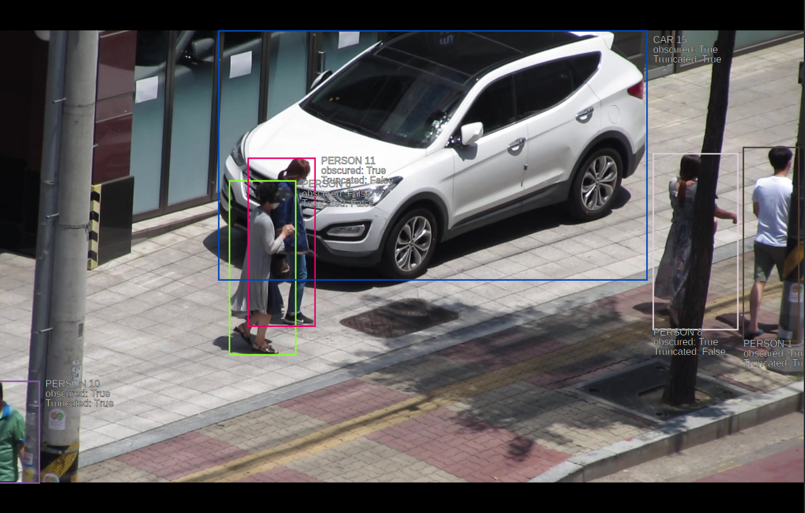

# drone-vis-recog-datasets-3

<br>

<h3>1. 구축목적 및 활용 분야</h3>

- 해외와 달리 국내의 경우 드론을 활용하여 사람 및 사물 등을 촬영하여 공개된 데이터셋이 전무함.

- 드론을 활용한 영상 인식 기술(객체 검출, 추적, 계수) 개발에 필요한 사람 및 사물 관련 데이터셋을 제공함.

- 안전, 교통, 보안 등의 드론을 활용한 다양한 지능형 영상 인식 산업 분야에 활용 가능함.

___


<h3>2. 구축 내용</h3>

- **데이터 개요**

  - **해상도**: 1920 x 1080(Full HD)
  
  - **프레임률**: 15 FPS(Frames Per Second)
  
  - **총 210 개 비디오 클립 중 70 개 비디오 클립**을 본 저장소에 공개(3개의 참여 업체가 70 개씩 배분하여 각 업체별로 저장소에 공개)

  - **각 비디오 클립 폴더**는 아래와 같은 파일들을 포함함.
  
    - 이미지 파일 450개(jpg 포맷)
    
    - Ground Truth 파일 1개(json 포맷)
    
    - 동영상 파일 1개(mp4 포맷)</br></br>
    

- **어노테이션 대상 및 방법** 
  
  - **대상**
  
    - 각 이미지에서 구분 가능한 6개의 “사람 및 사물”을 찾아 바운딩박스 좌표를 어노테이션 하고, 클래스 ID와 고유 ID(객체 ID)를 라벨링함.
  
    - 이 때 “사람 및 사물(이하 대상)”은 “사람, 소화기, 소화전, 차량, 자전거, 오토바이”로 한정함.
  
    - 클래스 ID, 객체 ID, 겹침 및 잘림 여부를 함께 라벨링함.
  
    - 승용차, 승합차, 버스, 트럭 및 트레일러 모두 차량으로 인지하여 계수함.
  
    - 하나의 비디오 클립(450개 이미지) 내 등장하는 전체 인물 및 사물의 수는 클래스별로 중복 없이 계수하여 라벨링함.
  
  - **방법**
    
      - 이미지에 나타나는 대상이 좌표로 표현되는 영역의 단축 기준 25 픽셀 이상일 경우, 1개(인) 단위의 바운딩박스로 처리함.
      
      - 대상이 겹치거나 화면에서 잘리더라도 픽셀 기준을 만족하며 육안으로 명확하게 대상으로 인지를 할 수 있다면, 이를 포함하여 처리함.
      
      - 동일한 대상으로 판단한 “사람 및 사물”은 하나의 비디오 클립 내 여러 번 등장하더라도 동일한 객체 ID를 가짐.
      
      - 객체의 크기는 동영상 내 해당 객체가 최초 등장 후 좌상단, 우하단 좌표로 표현되는 영역의 단축기준으로 25 픽셀 이상이면 대상 객체로 인정함.
      
      - 공개를 목적으로 하는 데이터이므로, 개인정보 보호를 위해 육안으로 식별 가능한 사람의 얼굴, 차량의 번호판 등은 흐리게 처리함.

___


<h3>3. 데이터셋 통계</h3>

- **아래는 본 저장소에 대한 통계로서, 전체 통계 및 상세 내용은 [데이터셋_통계.xlsx](./데이터셋_통계.xlsx) 파일을 참고할 것.**  

- **객체 통계**

  | **객체**                      | **클래스 아이디** | **객체 수** |
  | ----------------------------- | :-------------: | :-----------: |
  | **Person(사람)**              | c_1 | 594 |
  | **Fire Extinguisher(소화기)** | c_2 | 39 |
  | **Fire Hydrant(소화전)**      | c_3 | 10 |
  | **Car(차량)**                 | c_4 | 144 |
  | **Bicycle(자전거)**           | c_5 | 57 |
  | **Motorcycle(오토바이)**      | c_6 | 33 |
  | **합계**                      |      | **877** |

 

- **촬영조건 통계**
  
    <table>
       <thead align="center">
           <tr>               
               <th colspan=2><b>      촬영 조건      </b></th>
               <th colspan=1><b>비디오 클립 개수</b></th>
           </tr>
       </thead>
       <tbody align="center">
           <tr>
               <td>일출</td>
               <td>맑음</td>
               <td><b>0</b></td>
           </tr>
           <tr>               
               <td>일출</td>
               <td>흐림</td>
               <td><b>0</b></td>
           </tr>
           <tr>            
                <td>일출</td>
                <td>비</td>
                <td><b>0</b></td>                
           </tr>
           <tr>            
                <td>낮</td>
                <td>맑음</td>
                <td><b>29</b></td>
           </tr>
           <tr>            
                <td>낮</td>
                <td>흐림</td>
                <td><b>41</b></td>
           </tr>
           <tr>            
                <td>낮</td>
                <td>비</td>
                <td><b>0</b></td>
           </tr>
           <tr>            
                <td>일몰</td>
                <td>맑음</td>
                <td><b>0</b></td>
           </tr>
           <tr>            
                <td>일몰</td>
                <td>흐림</td>
                <td><b>0</b></td>
           </tr>
           <tr>            
                <td>일몰</td>
                <td>비</td>
                <td><b>0</b></td>
           </tr>
           <tr>            
                <td colspan=2><b>합계</b></td>
                <td><b>70</b></td>
           </tr>
	   </tbody>
	  </table>

___


<h3>4. 데이터 구조</h3>

- 최상위의 data 디렉토리에는 **비디오 클립명**으로 된 폴더들이 **70개** 있음.

- 각 비디오 클립 폴더 내부에는 **image** **폴더**, **json** **파일**, **mp4** **파일 등이** 있음.

  - **mp4 파일**

    - 동영상 파일

  - **image 폴더**

    - 하나의 비디오 클립을 나타내는 450 개의 연속된 이미지 파일들로 구성됨. 파일명은 **{비디오 클립명}_{시퀀스 아이디} 형식**으로 되어 있음.

    - 이미지 파일 예시

      
    
  - **json 파일**

    - 해당 비디오 클립에 대한 **Ground Truth** 파일 

    - 파일 내용 예시
  
      ```
      {
      	// 동영상 클립명
          "0615_V0049": {
              "videos": {
              	...
              	{	
              			// 시퀀스 아이디
                          "id": "00248",
                          "objects": [
                              {	
                              	// 오브젝트 아이디
                                  "id": "00000",
                                  // 클래스 아이디
                                  "class_ID": "c_1",
                                  // 바운딩박스 좌표값
                                  "position": [
                                      1775,
                                      278,
                                      1908,
                                      741
                                  ],
                                  // 오브젝트의 가려짐 여부
                                  "obsecured": "True",
                                  // 오브젝트의 잘림 여부
                                  "truncated": "True"
                              },
                              {
                                  "id": "00005",
                                  "class_ID": "c_1",
                                  "position": [
                                      549,
                                      358,
                                      707,
                                      773
                                  ],
                                  "obsecured": "False",
                                  "truncated": "False"
                              },
                              {
                                  "id": "00007",
                                  "class_ID": "c_1",
                                  "position": [
                                      1560,
                                      293,
                                      1762,
                                      713
                                  ],
                                  "obsecured": "True",
                                  "truncated": "False"
                              },
                              {
                                  "id": "00009",
                                  "class_ID": "c_1",
                                  "position": [
                                      0,
                                      837,
                                      95,
                                      1080
                                  ],
                                  "obsecured": "True",
                                  "truncated": "True"
                              },
                              {
                                  "id": "00010",
                                  "class_ID": "c_1",
                                  "position": [
                                      594,
                                      304,
                                      753,
                                      705
                                  ],
                                  "obsecured": "True",
                                  "truncated": "False"
                              },
                              {
                                  "id": "00014",
                                  "class_ID": "c_4",
                                  "position": [
                                      523,
                                      0,
                                      1545,
                                      595
                                  ],
                                  "obsecured": "True",
                                  "truncated": "True"
                              }
                          ]
                      },
                      ...
            	
      ```
    </br>
___

 

<h3>5. 데이터셋 관련 담당자</h3>

| **회사명**    | **부서명**       | **이름**   | **전화번호**      | **이메일**              |
| ------------- | ---------------- | ---------- | ----------------- | ----------------------- |
| **㈜ 엠티콤** | **서비스기획팀** | **유한별** | **070-4671-0084** | **onestar@mtcom.co.kr** |

___

 

<h3>6. 알림</h3>


- 본 데이터셋은 과학기술정보통신부의 **인공지능산업원천기술개발 사업(과제번호: 2019-0-01763)의 일환으로 구축**되었으며, **공개 S/W로 제공**됨.

- 데이터셋은 대용량 다운로드를 고려하여 **참여 업체당 1개씩, 총 3개의 저장소로 분리하여 저장**하였으며, **각 저장소 마다 70개씩 전체 210개의 비디오 클립**이 있음. 

- **본 저장소에는 141번째부터 210번째까지의 70개 비디오 클립**에 대한 데이터셋이 저장되어 있음.

- **저장소 1 링크**:

- **저장소 2 링크**:

